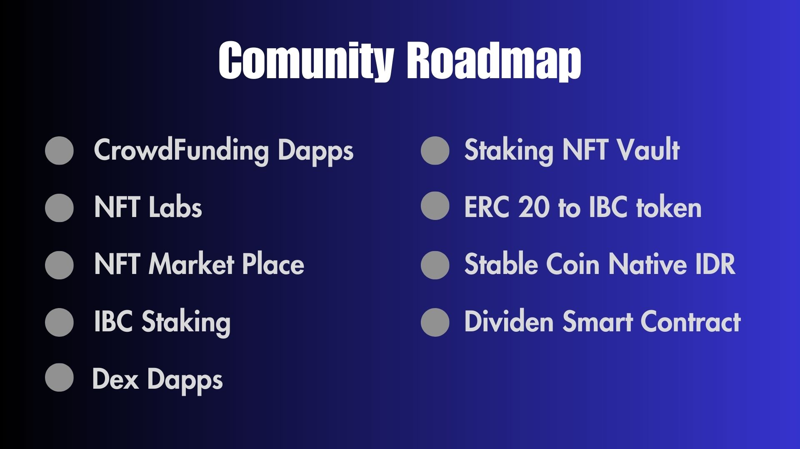

# Comunity Node

Community Node is a dynamic and forward-thinking Blockchain organization based in Surabaya, Indonesia. we run blockchain validator Node since 2022, we have been dedicated to promoting the adoption, education, and innovation of Blockchain technology within our local community.

## RoadMap

Our roadmap represents a clear vision and a structured approach towards achieving our goals as a blockchain organization. Through education, collaboration, use case development, pilot projects, scaling, and continuous research and development, we aim to make a lasting impact on the blockchain ecosystem. By building a strong foundation driven by Comunity, fostering partnerships, and embracing emerging technologies, we are confident in our ability to shape the future and drive the widespread adoption of blockchain technology. Together, we will create a more decentralized, transparent, and equitable world for generations to come.

Our team has been working tirelessly to create a revolutionary crowdfunding platform powered by blockchain technology. With these dapps, we aim to redefine the way projects are funded, empowering creators and revolutionizing the crowdfunding landscape.

\

<figure><figcaption></figcaption></figure>

